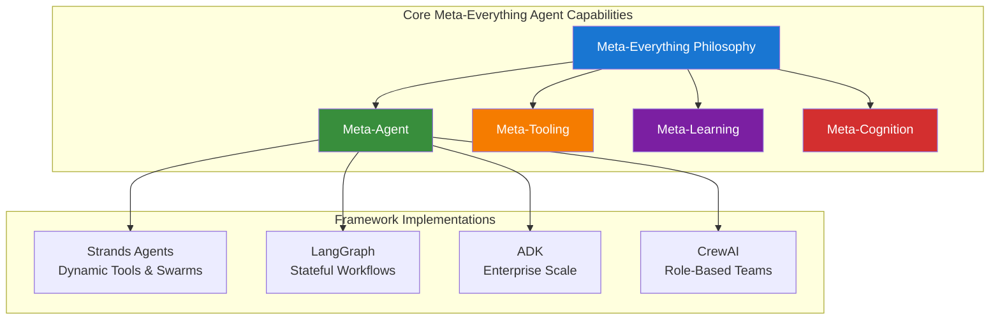

# Meta-Everything Agents

Meta-Everything Agent implementations across multiple agentic AI frameworks, demonstrating practical patterns, performance comparisons, and architectural approaches to self-evolving AI systems.

## Overview

This repository implements the same Meta-Everything Agent concept across four different agentic frameworks. Each implementation maintains the core functionality while showcasing the unique strengths, patterns, and practical limits of each SDK.

### What is Meta-Everything Agent?

Meta-Everything Agent is an AI system that embodies a "meta-everything" philosophy:
- **Meta-Agent**: Dynamically spawns specialized agents for complex tasks
- **Meta-Tooling**: Creates and modifies tools at runtime
- **Meta-Learning**: Persistent cross-session memory for continuous improvement
- **Meta-Cognition**: Self-reflection and confidence assessment for strategic decisions

## Implementations

### [Strands Agents SDK](/strands-agents)
**Status**: Work in Progress
**Focus**: Native implementation showcasing dynamic tool creation and swarm orchestration
- Runtime tool generation with validation
- Multi-agent coordination via swarm patterns
- Memory persistence with FAISS/Mem0/OpenSearch
- AWS Bedrock and Ollama model support

### [LangGraph](/langgraph)
**Status**: Not Started
**Focus**: Graph-based agent orchestration and state management
- Stateful agent workflows with checkpointing
- Visual graph representation of agent interactions
- Built-in persistence and time-travel debugging
- Streaming and async execution patterns

### [ADK (Agent Development Kit)](/adk)
**Status**: Not Started
**Focus**: Enterprise-grade agent deployment and monitoring
- Production-ready agent scaffolding
- Built-in observability and metrics
- Distributed agent coordination
- Model-agnostic architecture

### [CrewAI](/crewai)
**Status**: Not Started
**Focus**: Role-based multi-agent collaboration
- Hierarchical agent organization
- Role and goal-driven agent behaviors
- Process templates (sequential, hierarchical, custom)
- Human-in-the-loop capabilities

## Architecture



## Key Differentiators

| Feature | Strands Agents | LangGraph | ADK | CrewAI |
|---------|---------------|-----------|-----|---------|
| **Tool Creation** | Runtime generation | Graph nodes | Plugin system | Tool delegation |
| **Multi-Agent** | Swarm patterns | Graph orchestration | Service mesh | Crew hierarchy |
| **Memory** | FAISS/Mem0/OpenSearch | Checkpoints | State store | Shared context |
| **Execution** | Step-based | Graph traversal | Event-driven | Process flows |

## Implementation Patterns

### Common Patterns Across All Frameworks

1. **Confidence-Based Routing**
   - High confidence (>80%): Direct execution
   - Medium (50-80%): Tool creation/enhancement
   - Low (<50%): Multi-agent delegation

2. **Memory Persistence**
   - Vector-based similarity search
   - Session continuity
   - Learning from past executions

3. **Tool Lifecycle Management**
   - Dynamic creation
   - Validation and testing
   - Runtime modification

## Performance Benchmarks

*Benchmarks coming soon - will compare:*
- Task completion time
- Token efficiency
- Memory usage
- Success rates across task categories
- Framework overhead

## Getting Started

### Prerequisites

- Python 3.10+
- Git
- Framework-specific requirements (see individual READMEs)

### Installation

```bash
# Clone the repository
git clone https://github.com/agentic-community/wg-development.git
cd wg-development/meta-everything-agent

# Choose an implementation
cd strands-agents  # or langgraph, adk, crew-ai

# Follow framework-specific setup instructions
```

### Quick Start

Each implementation maintains the same interface:

```python
# Example for any framework
from metaagent import MetaEverythingAgent

agent = MetaEverythingAgent()
result = agent.run("Create a tool to analyze sentiment in text")
```

## Use Cases

### Dynamic Tool Creation
Meta-Everything Agent creates specialized tools on-demand for any task, testing and validating them before use.

### Multi-Agent Orchestration
Complex problems trigger automatic spawning of specialized agents that collaborate to find solutions.

### Continuous Learning
Every execution contributes to the knowledge base, improving future performance on similar tasks.

### Self-Improvement
Meta-Everything Agent analyzes its own performance and adjusts strategies based on success metrics.

## Project Structure

```
agentic-community-meta-agent/
├── README.md                 # This file
├── LICENSE                   # MIT License
├── meta-everything-agent/
│   └── adk/                 # ADK implementation (coming soon)
│   └── crew-ai/             # Crew AI implementation (coming soon)
│   └── langgraph/           # LangGraph implementation (coming soon)
│   └── strands-agents/      # Strands SDK implementation
│       ├── src/
│       ├── pyproject.toml
│       └── README.md
```

## Contributing

We welcome contributions! Areas of interest:
- Additional framework implementations
- Performance optimizations
- New meta-capabilities
- Benchmark suites
- Documentation improvements

## Community

- **Discussions**: [GitHub Discussions](https://github.com/sriaradhyula/agentic-community-meta-agent/discussions)
- **Issues**: [GitHub Issues](https://github.com/sriaradhyula/agentic-community-meta-agent/issues)
- **Updates**: Watch this repository for updates

## Acknowledgments

- [Strands Agents SDK](https://github.com/strands-agents/sdk-python) for the foundational framework
- [LangGraph](https://github.com/langchain-ai/langgraph) for graph-based orchestration patterns
- [ADK](https://github.com/example/adk) for enterprise agent patterns
- [CrewAI](https://github.com/joaomdmoura/crewAI) for role-based agent collaboration

## Security

See [CONTRIBUTING](CONTRIBUTING.md#security-issue-notifications) for more information.

## License

This project is licensed under the [Apache-2.0 License](LICENSE).