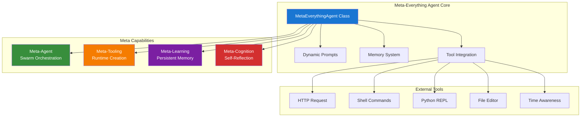
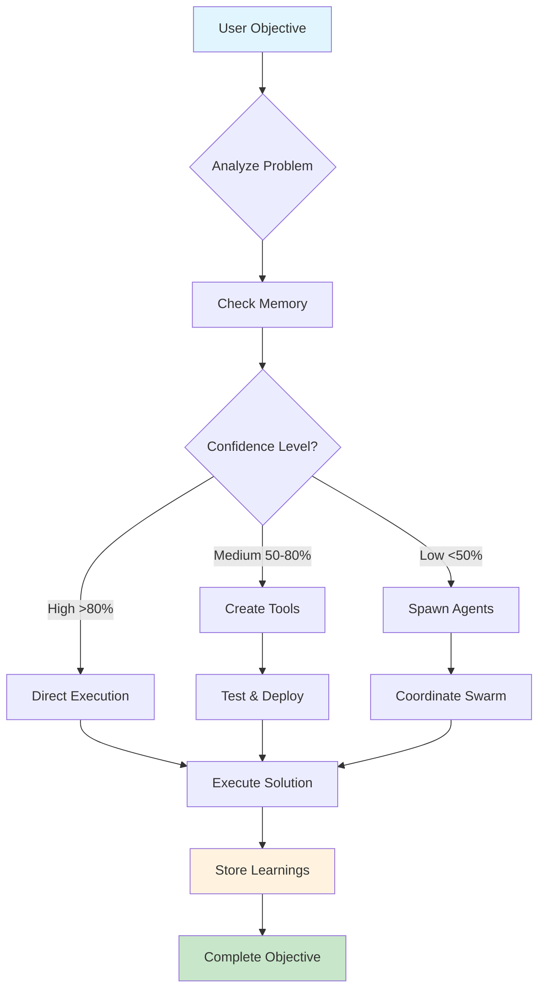
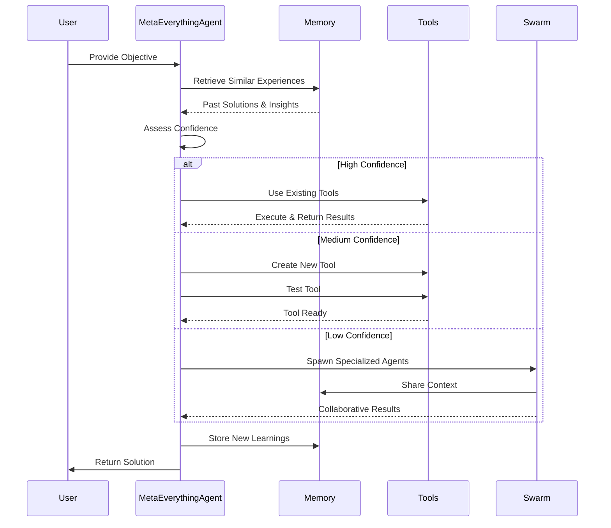
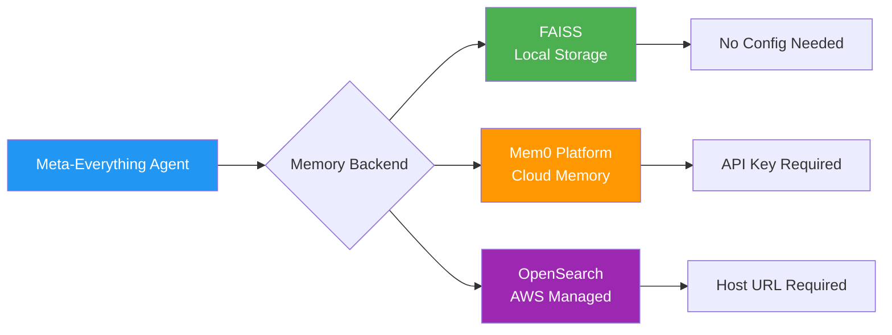

# Meta-Everything Agent (Strands SDK Implementation)

A self-evolving AI system built on the [Strands SDK](https://github.com/strands-agents/sdk-python) that embodies a "meta-everything" philosophy. Meta-Everything Agent dynamically adapts to any problem domain through runtime tool creation, multi-agent orchestration, and continuous learning.

## Features

### Meta-Everything Capabilities

**Meta-Agent**: Dynamically spawns specialized agents for complex tasks using the swarm tool

**Meta-Tooling**: Creates and modifies tools at runtime using the editor tool

**Meta-Learning**: Persistent cross-session memory enables continuous improvement

**Meta-Cognition**: Self-reflection and confidence assessment drives strategic decisions

**External Integration**: Access web APIs and external data sources using the http_request tool

**System Operations**: Install packages and run system commands using the shell tool

**Time Awareness**: Track time across timezones for scheduling and temporal analysis using the current_time tool

## Quick Start

### Prerequisites

- Python 3.10+
- AWS credentials configured (for Bedrock models)
- (Optional) Mem0 API key or OpenSearch instance for cloud memory

### Installation

```bash
# Clone the repository
git clone https://github.com/sriaradhyula/agentic-community-meta-agent.git
cd agentic-community-meta-agent/strands-agents/MetaEverythingAgent

# Create virtual environment
python -m venv venv
source venv/bin/activate  # On Windows: venv\Scripts\activate

# Install the package and dependencies
pip install -e .

# Copy environment file
cp .env.example .env
# Edit .env with your configuration
```

### Basic Usage

```bash
# Simple task
python -m src.main "Create a tool to analyze sentiment in text"

# Complex task with more steps
python -m src.main "Build a system to monitor and visualize server health metrics" --steps 20

# Use a different model
python -m src.main "Generate a financial report" --model us.anthropic.claude-3-5-sonnet-20241022-v1:0

# Disable thinking mode for faster execution
python -m src.main "Summarize this document" --no-thinking

# Custom memory location
python -m src.main "Learn about quantum computing" --memory-path ./quantum_memory

# Fetch external data
python -m src.main "Get the current weather in San Francisco and analyze the trend"

# Install and use packages
python -m src.main "Install and use pandas to analyze a CSV file"

# Time-based task
python -m src.main "Create a reminder system that tracks tasks with timestamps"
```

## Architecture



### Project Structure

```
MetaEverythingAgent/
├── src/
│   ├── agent.py       # Core MetaEverythingAgent class
│   ├── prompts.py     # System prompts enabling meta behaviors
│   ├── main.py        # CLI interface
│   └── tools/
│       ├── __init__.py
│       └── memory.py  # Memory management tool
├── pyproject.toml     # Project configuration
├── .env.example       # Environment template
└── README.md          # Documentation
```

## How It Works



### Execution Flow



## Examples

### Creating a Custom Tool

```python
from src import MetaEverythingAgent

agent = MetaEverythingAgent()
result = agent.run("Create a tool to fetch and parse RSS feeds")
# Meta-Everything Agent will create a custom RSS parser tool and test it
```

### Multi-Agent Orchestration

```python
result = agent.run("Analyze market trends and generate investment recommendations")
# Meta-Everything Agent will spawn research, analysis, and recommendation agents
```

### Learning from Experience

```python
# First run
result = agent.run("Build a web scraper for news articles")

# Later run - will use learned strategies
result = agent.run("Create a scraper for blog posts")
```

## Memory Backends



### FAISS (Default)
Local vector storage
- No configuration needed
- Stores in `./meta_everything_agent_memory_*`

### Mem0 Platform
Cloud-based memory
- Set `MEM0_API_KEY` in `.env`
- Automatic cloud sync

### OpenSearch
AWS managed search
- Set `OPENSEARCH_HOST` in `.env`
- Enterprise-scale memory

## CLI Options

```bash
python -m src.main [objective] [options]

Options:
  --model MODEL         Model ID (default: Sonnet 4 for Bedrock, llama3.2:3b for Ollama)
  --server TYPE         Server type: 'remote' or 'local' (default: remote)
  --steps STEPS         Max execution steps (default: 10)
  --no-thinking        Disable interleaved thinking
  --memory-path PATH   Custom FAISS memory location
  --no-memory          Disable memory system
  --verbose, -v        Enable verbose logging
```

## Dependencies

Meta-Everything Agent uses:
- `strands-agents==0.1.6` - Core agent framework
- `strands-agents-tools` - Extended tool library from feature branch
- `mem0ai` - Memory management system
- `faiss-cpu` - Vector storage backend
- `boto3` - AWS SDK for Bedrock models
- `opensearch-py` - OpenSearch client
- `rich` - Terminal formatting

## Contributing

Contributions are welcome. Please feel free to submit a Pull Request.

## License

This project is licensed under the MIT License - see the LICENSE file for details.
